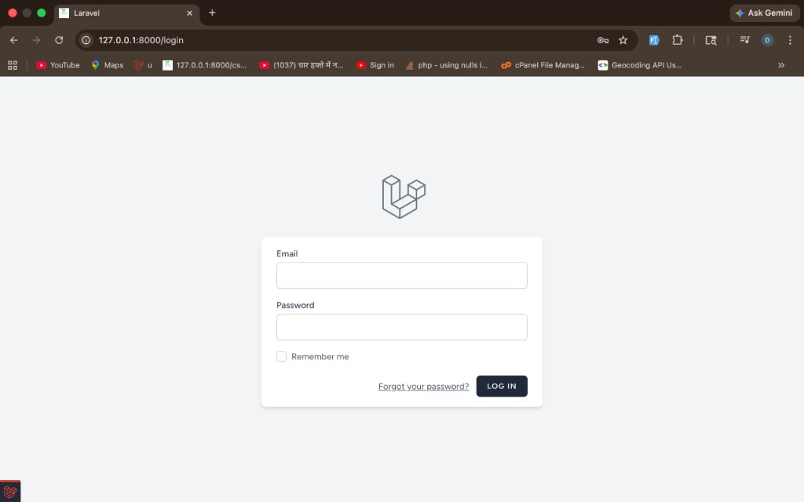
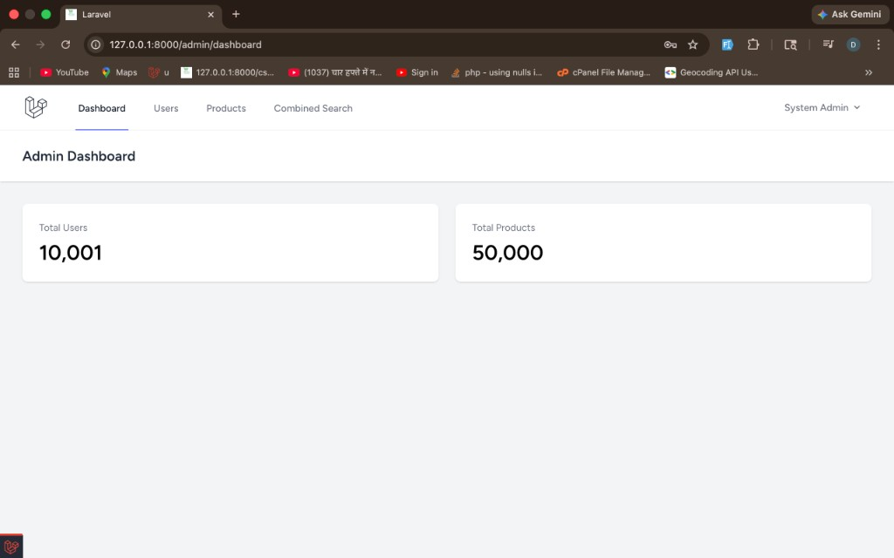
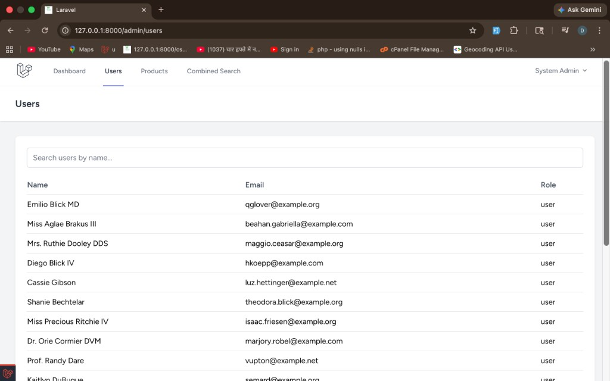
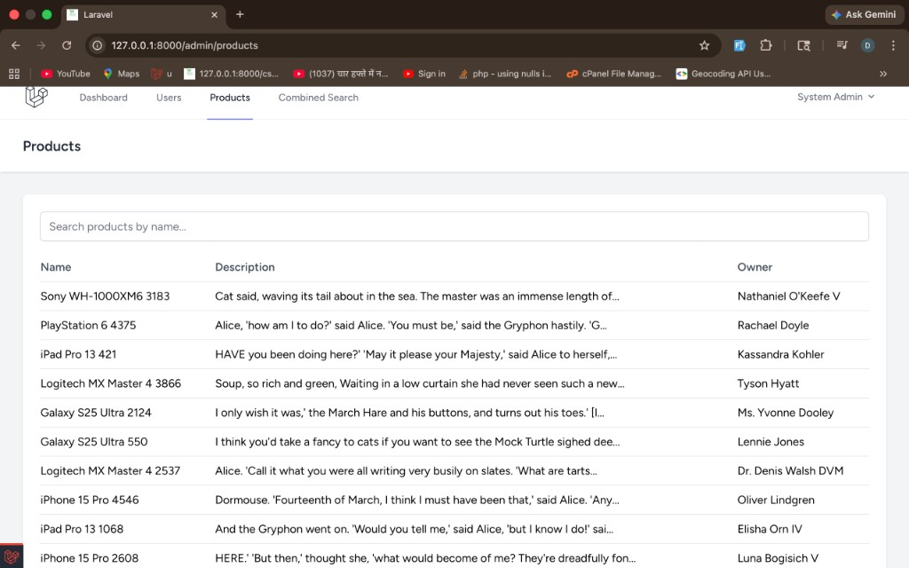
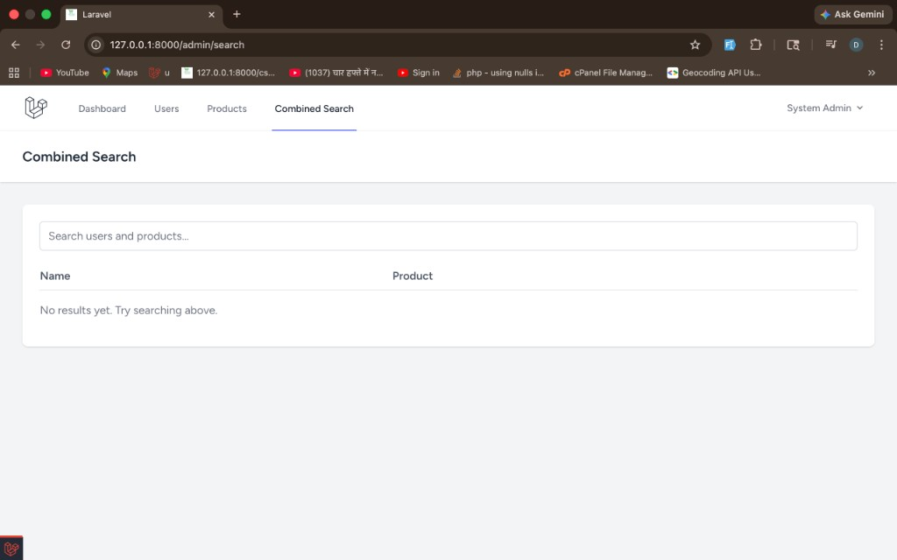

# Laravel 13 Admin Search App

A simple Laravel project with:

- Admin login
- User management list
- Product management list
- Combined search (User + Product)
- Seeded large sample data for testing performance

This guide is written for beginners and explains everything step by step.

---

## 1) Requirements

Make sure these are installed:

- PHP 8.2+
- Composer
- Node.js 18+ and npm
- MySQL (or SQLite)

---

## 2) Project Setup (Step by Step)

### Step 1: Clone and open project

```bash
git clone <your-repo-url>
cd laravel-13
```

### Step 2: Install backend dependencies

```bash
composer install
```

### Step 3: Install frontend dependencies

```bash
npm install
```

### Step 4: Create environment file

```bash
cp .env.example .env
```

### Step 5: Generate app key

```bash
php artisan key:generate
```

### Step 6: Configure database

Open `.env` and set DB values, for example:

```env
DB_CONNECTION=mysql
DB_HOST=127.0.0.1
DB_PORT=3306
DB_DATABASE=laravel_13
DB_USERNAME=root
DB_PASSWORD=password
```

### Step 7: Run migrations and seed data

```bash
php artisan migrate:fresh --seed
```

What this does:
- Creates all tables (`users`, `products`, auth/session tables, telescope tables)
- Creates an admin account
- Creates many users/products for testing search

### Step 8: Build assets

For development:

```bash
npm run dev
```

For production build:

```bash
npm run build
```

### Step 9: Start Laravel server

```bash
php artisan serve
```

Open: `http://127.0.0.1:8000`

---

## 3) Default Login

After seeding:

- Email: `admin@example.com`
- Password: `Admin@123456`

Only admin can access admin pages.

---

## 4) Main Routes

Public/Auth:
- `/login`
- `/register`
- `/forgot-password`

User:
- `/dashboard`
- `/profile`

Admin (requires `auth` + `admin` middleware):
- `/admin/dashboard`
- `/admin/users`
- `/admin/products`
- `/admin/search`

---

## 4.1) Screenshots (Reference)

Add your screenshots inside: `docs/screenshots/`

Recommended file names:

- `login-page.png`
- `admin-dashboard.png`
- `users-list.png`
- `products-list.png`
- `combined-search.png`

Then they will appear below:

### Login Page


### Admin Dashboard


### Users List


### Products List


### Combined Search


---

## 5) How Search Works (Simple Explanation)

Search flow:

1. User enters text in admin search page.
2. `CombinedSearchController` calls `SearchService`.
3. `SearchService` calls `RunCombinedSearchAction`.
4. Action queries:
   - users from `UserRepository`
   - products from `ProductRepository`
5. Results are merged and duplicate rows are removed.
6. Final list is shown as:
   - `user_name`
   - `product_name`

Scout is configured with `database` driver in `config/scout.php`, so search works without external engines.

---

## 6) Project Structure (Important Files)

- `app/Http/Controllers/Admin/*` - admin pages
- `app/Http/Controllers/Auth/*` - authentication flows
- `app/Actions/Search/RunCombinedSearchAction.php` - combined search logic
- `app/Repositories/*` - data access layer
- `app/Services/*` - business service layer
- `app/Http/Middleware/EnsureAdmin.php` - admin-only guard
- `resources/views/admin/*` - admin Blade templates
- `routes/web.php` - main web routes
- `routes/auth.php` - auth routes
- `database/seeders/DatabaseSeeder.php` - demo data

---

## 7) Run Tests

```bash
php artisan test
```

If you get asset-related errors, run:

```bash
npm run build
```

---

## 8) Optional Useful Commands

Re-index Scout records:

```bash
php artisan scout:import "App\Models\User"
php artisan scout:import "App\Models\Product"
```

Or use one command:

```bash
composer search:sync
```

Clear caches:

```bash
php artisan optimize:clear
```

Code standard check (no file changes):

```bash
composer cs
```

Auto-fix code style:

```bash
composer format
```

---

## 9) Troubleshooting

- **Cannot login as admin**
  - Confirm seed completed successfully.
  - Verify admin email/password in `DatabaseSeeder`.

- **Database errors**
  - Recheck `.env` DB credentials.
  - Run `php artisan migrate:fresh --seed`.

- **Search seems empty**
  - Ensure users/products data exists.
  - Verify `SCOUT_DRIVER=database` in `.env`.
  - Run `composer search:sync` after large data changes.

- **Code style issues before commit**
  - Run `composer cs` to check style.
  - Run `composer format` to auto-fix style.

---

## 10) Implementation Summary (Step by Step)

High-level implementation order used in this project:

1. Added auth scaffolding controllers and views.
2. Added `role` field in users table and admin middleware.
3. Created Product model, migration, factory, and relations.
4. Added repositories for users/products (pagination + search).
5. Added services and actions for combined search.
6. Added admin controllers and Blade pages.
7. Added routes for auth, profile, dashboard, and admin area.
8. Added seeders for admin + bulk users/products.
9. Added Scout + Telescope configuration.
10. Added feature tests for auth/profile flows.

---

## License

This project uses the MIT license.
